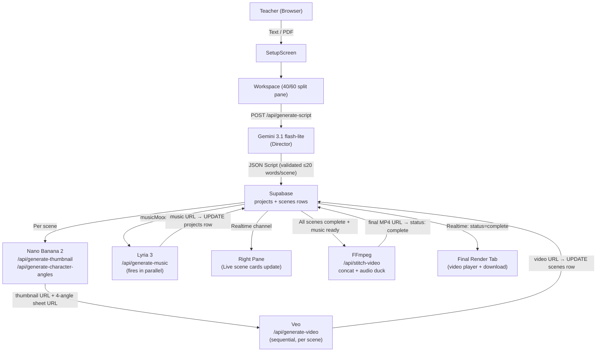
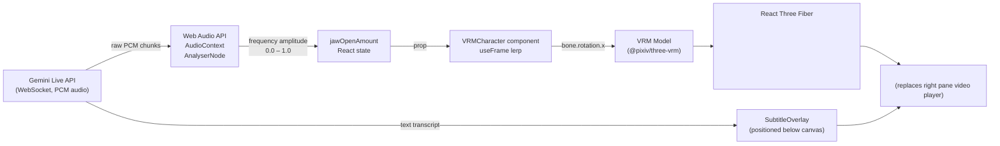

# TutorFilm — Comprehensive Planning Document

> **Hackathon:** 36-hour solo build (sprint schedule structured as 2-dev split for AI-assisted parallel execution)
> **Stack:** Next.js 16, React 19, TypeScript, Tailwind CSS v4, shadcn/ui, Zustand, Supabase, fluent-ffmpeg

---

## Table of Contents

1. [Executive Summary](#1-executive-summary)
2. [System Architecture](#2-system-architecture)
3. [Data Models & Schema](#3-data-models--schema)
4. [MVP Scope](#4-mvp-scope)
5. [Future Feature: The VTuber](#5-future-feature-the-vtuber-post-mvp)
6. [36-Hour Sprint Schedule](#6-36-hour-sprint-schedule)
7. [Key Files Reference](#7-key-files-reference)

---

## 1. Executive Summary

TutorFilm is an AI-directed educational video factory for teachers. A teacher inputs a lesson concept (plain text or PDF), selects an avatar style, and picks a voice tone. The app's **AI Director** (Gemini 3.1 flash-lite) parses the input and emits a validated JSON script broken into 8-second scenes, each capped at a strict **18–20 word dialogue limit** so Veo's native audio never cuts off mid-sentence.

From that script, parallel pipelines fire:

- **Nano Banana 2** generates Pixar/Disney Junior-style scene thumbnails and — if a custom teacher avatar is requested — a 4-angle character reference sheet from a selfie upload.
- **Veo** ingests each thumbnail (as a reference frame), the 4-angle sheet (for avatar consistency), and the scene dialogue, then renders an 8-second MP4 with the teacher's voiceover baked in natively using a hyper-specific fantastical voice description from the **Voice Catalog**.
- **Lyria 3** scores an epic background music track in parallel, tuned to the lesson's emotional keywords.

Finally, **FFmpeg** on the server concatenates all scene clips, maps the Lyria track as a secondary audio input, and applies an `amix` filter with `volume=0.15` so background music sits quietly underneath the native Veo dialogue — exactly like routing a music bed underneath a vocal track in FL Studio. The teacher watches scenes appear live in the right pane as each one finishes, powered by Supabase Realtime.

### The Agentic Workspace UI

The UI is a **40/60 split-pane** workspace after the setup screen:

| Left Pane (40%) — Director's Desk | Right Pane (60%) — AI's Canvas |
|---|---|
| Avatar mode toggle (off / default / custom) | Live generation progress timeline |
| Voice catalog selector | Script & Prompts tab (scene cards appear as generated) |
| Selfie upload (custom avatar) | Thumbnails tab (images appear as generated) |
| Generate button | Videos tab (clips appear as each scene completes) |
| — | Final Render tab (player + download button) |

---

## 2. System Architecture

```
┌─────────────────────────────────────────────────────────────────────┐
│                        Teacher's Browser                            │
│                                                                     │
│  SetupScreen ──► 40/60 Workspace                                    │
│                  ├── LeftPane (inputs, avatar, voice, generate)     │
│                  └── RightPane (progress, script, videos, player)   │
│                       │                                             │
│                       │  Supabase Realtime (scenes subscription)    │
└───────────────────────┼─────────────────────────────────────────────┘
                        │
          ┌─────────────▼──────────────┐
          │   Next.js API Routes        │
          │                             │
          │  POST /api/generate-script  │──► Gemini 3.1 flash-lite
          │  POST /api/generate-angles  │──► Nano Banana 2
          │  POST /api/generate-thumb   │──► Nano Banana 2
│  POST /api/generate-video   │──► Veo (per scene)
│  POST /api/stitch-scenes    │──► FFmpeg concat (scene MP4s → master for Lyria)
│  POST /api/generate-music   │──► Lyria 3
│  POST /api/stitch-video     │──► FFmpeg (server-side, mux music into final)
          └─────────────┬───────────────┘
                        │
          ┌─────────────▼───────────────┐
          │          Supabase            │
          │                             │
          │  projects table             │
          │  scenes table (Realtime)    │
          │  Storage (PDFs, MP4s)       │
          └─────────────────────────────┘
```

### Mermaid Diagram



### Key Architectural Decisions

| Decision | Rationale |
|---|---|
| Gemini script generation is **synchronous** | Fast (≤3s), the script must exist before anything else fires |
| Video generation is **sequential per scene** (not `Promise.all`) | Respects Veo rate limits; UI updates after each clip, not all at once |
| Supabase **Realtime** subscription drives the right pane | No polling; `scenes` row updates push to browser instantly |
| Lyria music fires **concurrently** with video loop | Music has no dependency on individual scenes; parallelizing saves ~15s |
| **Finalize lesson** triggers `POST /api/stitch-scenes` | Concatenates scene MP4s in order; uploads master to Storage; sets `projects.assembled_scenes_video_url` for the Lyria scoring step; final mux (music bed) remains `POST /api/stitch-video` → `final_video_url` |
| FFmpeg runs **server-side** for assembly and final stitch | Temp files cleaned after upload; `stitch-scenes` uses libx264/aac for reliable concat across Veo outputs |
| No blocking `Promise.all` for video gen | Frontend calls `/api/generate-video` for one scene, awaits, moves to next — right pane scene cards light up one by one |

---

## 3. Data Models & Schema

### 3.1 Supabase SQL Schema

```sql
-- Run in Supabase SQL editor

create table projects (
  id            uuid primary key default gen_random_uuid(),
  session_id    text not null,
  status        text not null default 'scripting',
  -- status: 'scripting' | 'generating_assets' | 'generating_videos'
  --         | 'composing_music' | 'stitching' | 'complete' | 'error'
  lesson_prompt text,
  pdf_url       text,
  avatar_type   text not null default 'none',
  -- avatar_type: 'none' | 'default_male' | 'default_female' | 'custom'
  voice_character_id text,
  character_angles_url text,
  script_json   jsonb,
  music_url     text,
  assembled_scenes_video_url text,  -- FFmpeg concat of scenes; Lyria input; then mux → final_video_url
  final_video_url text,
  created_at    timestamptz default now()
);

create table scenes (
  id             uuid primary key default gen_random_uuid(),
  project_id     uuid references projects(id) on delete cascade,
  "order"        int not null,
  dialogue       text not null,
  word_count     int not null,
  visual_prompt  text not null,
  scene_type     text not null default 'broll',
  -- scene_type: 'avatar_present' | 'broll' | 'mixed'
  thumbnail_url  text,
  video_url      text,
  status         text not null default 'pending',
  -- status: 'pending' | 'thumbnail_generating' | 'thumbnail_ready'
  --         | 'video_generating' | 'complete' | 'error'
  created_at     timestamptz default now()
);

-- Enable Realtime on scenes table
alter publication supabase_realtime add table scenes;
alter publication supabase_realtime add table projects;
```

### 3.2 TypeScript Interfaces (`lib/types.ts`)

```typescript
// ─── Enums / Union Types ────────────────────────────────────────────────────

export type AvatarType = 'none' | 'default_male' | 'default_female' | 'custom'
export type SceneType = 'avatar_present' | 'broll' | 'mixed'

export type ProjectStatus =
  | 'idle'
  | 'scripting'
  | 'generating_assets'
  | 'generating_videos'
  | 'composing_music'
  | 'stitching'
  | 'complete'
  | 'error'

export type SceneStatus =
  | 'pending'
  | 'thumbnail_generating'
  | 'thumbnail_ready'
  | 'video_generating'
  | 'complete'
  | 'error'

// ─── Core Domain Types ──────────────────────────────────────────────────────

export interface Scene {
  id: string
  order: number
  sceneType: SceneType
  dialogue: string      // HARD LIMIT: ≤20 words — enforced server-side before DB insert
  wordCount: number
  visualPrompt: string  // passed to Nano Banana 2 for thumbnail generation
  thumbnailUrl: string | null
  videoUrl: string | null
  status: SceneStatus
}

export interface Project {
  id: string
  sessionId: string
  status: ProjectStatus
  lessonPrompt: string
  pdfUrl: string | null
  avatarType: AvatarType
  voiceCharacterId: string        // key into VOICE_CATALOG
  characterAnglesUrl: string | null  // Nano Banana 2 4-angle sheet output URL
  script: GeminiScriptOutput | null
  scenes: Scene[]
  musicUrl: string | null
  finalVideoUrl: string | null
}

export interface LessonData {
  lessonPrompt: string
  uploadedFile: string | null     // display name only (e.g. "chapter3.pdf")
  uploadedFileUrl: string | null  // Supabase Storage public URL
  duration: number                // target minutes → used to calculate scene count
}

// ─── Gemini Director Output ─────────────────────────────────────────────────

export interface GeminiScriptOutput {
  title: string
  targetAge: string   // e.g. "5-8"
  artStyle: 'pixar_3d' | 'disney_junior' | 'watercolor_storybook'
  voiceCharacterId: string  // must be a valid key from VOICE_CATALOG
  musicMood: string         // e.g. "adventurous, orchestral, childlike wonder"
  scenes: GeminiRawScene[]
}

export interface GeminiRawScene {
  order: number
  sceneType: SceneType
  dialogue: string      // Gemini is prompted to keep this ≤20 words
  visualPrompt: string  // detailed Pixar/Disney art direction prompt
}

// ─── API Request / Response Types ───────────────────────────────────────────

export interface GenerateScriptRequest {
  lessonPrompt: string
  pdfUrl?: string
  avatarType: AvatarType
  voiceCharacterId: string
  targetDurationMinutes: number
}

export interface GenerateScriptResponse {
  projectId: string
  script: GeminiScriptOutput
  scenes: Scene[]
}

export interface GenerateVideoRequest {
  sceneId: string
  projectId: string
  thumbnailUrl: string
  visualPrompt: string
  dialogue: string
  voiceCharacterId: string
  characterAnglesUrl?: string
}

export interface GenerateVideoResponse {
  videoUrl: string
}

export interface StitchVideoRequest {
  projectId: string
  sceneVideoUrls: string[]  // ordered array
  musicUrl: string
}

export interface StitchVideoResponse {
  finalVideoUrl: string
}
```

### 3.3 Zustand Store (`lib/store.ts`)

```typescript
import { create } from 'zustand'
import type { Project, Scene, LessonData, ProjectStatus } from './types'

interface TutorFilmStore {
  // ── Setup phase ────────────────────────────────────────────────────────────
  lessonData: LessonData | null
  setLessonData: (data: LessonData) => void

  // ── Project state (source of truth synced from Supabase) ──────────────────
  project: Project | null
  setProject: (project: Project) => void
  updateScene: (sceneId: string, updates: Partial<Scene>) => void
  updateProjectStatus: (status: ProjectStatus) => void
  setMusicUrl: (url: string) => void
  setFinalVideoUrl: (url: string) => void

  // ── UI state ───────────────────────────────────────────────────────────────
  currentTab: 'script' | 'thumbnails' | 'videos' | 'final'
  setCurrentTab: (tab: TutorFilmStore['currentTab']) => void
  hasStarted: boolean
  setHasStarted: (started: boolean) => void
}
```

### 3.4 Voice Catalog (`lib/voice-catalog.ts`)

Veo currently cannot maintain consistent voice identity across separate video generation calls. The workaround is to maintain a catalog of **hyper-specific fantastical voice descriptions** — so unique that the model must consistently invent the same vocal character each time. Fictional / fantastical voices are preferred since the output videos target children and benefit from imaginative characters.

```typescript
export const VOICE_CATALOG: Record<string, { label: string; description: string }> = {
  woodland_gnome_scholar: {
    label: 'Woodland Gnome Scholar',
    description:
      'A cheerful, lightly raspy voice of an ancient woodland gnome who has been teaching forest creatures for three centuries, speaking with warm gravitas and a small happy chuckle at the end of sentences',
  },
  ocean_mermaid_sage: {
    label: 'Ocean Mermaid Sage',
    description:
      'A smooth, resonant voice of a deep-sea mermaid scholar, speaking with a gentle lilting cadence, as if each word is carried by a slow warm current beneath the waves',
  },
  sun_sprite_enthusiast: {
    label: 'Sun Sprite Enthusiast',
    description:
      'A bright, melodic voice of a tiny sun-sprite who vibrates with warm energy, speaking at a pace just slightly faster than human out of pure excited joy for sharing knowledge',
  },
  sky_guardian_wise: {
    label: 'Sky Guardian',
    description:
      'A gentle, airy voice of a cloud-weaving sky guardian who has watched civilizations rise and fall, speaking with patient cosmic calm and a soft echo like wind through mountain peaks',
  },
  mountain_giant_soft: {
    label: 'Mountain Giant',
    description:
      'A warm, low-rumbling voice of a kindly mountain giant who learned to speak softly after accidentally startling too many valley villages, now permanently hushed yet full of deep vibrant warmth',
  },
  crystal_cave_wizard: {
    label: 'Crystal Cave Wizard',
    description:
      'A crisp, slightly echoing voice of an ancient wizard who has lived inside a crystal cave so long that every word carries a faint harmonic resonance, always measured and mysteriously joyful',
  },
}

// Veo voice prompt builder
export function buildVoicePrompt(voiceCharacterId: string, dialogue: string): string {
  const voice = VOICE_CATALOG[voiceCharacterId]
  if (!voice) throw new Error(`Unknown voice character: ${voiceCharacterId}`)
  return `Narrate in the voice of: ${voice.description}. Say exactly the following words and no others: "${dialogue}"`
}
```

---

## 4. MVP Scope

### 4.1 Must Ship for Hackathon Demo

#### SetupScreen
- Text input (lesson concept) + PDF drag-and-drop upload
- PDF uploads to **Supabase Storage** before navigating to workspace
- Duration slider (1–10 min) → maps to scene count: `Math.ceil(duration * 60 / 8)`
- Validation: at least one of text or PDF required

#### Gemini Director (`/api/generate-script`)
- System prompt includes the strict JSON schema and enforces the **≤20 word dialogue limit** explicitly
- Server-side `validateScenes()` checks word counts after parsing; re-prompts once if any scene exceeds the limit
- Inserts `projects` row + all `scenes` rows to Supabase
- Returns `{ projectId, script, scenes }`

**Gemini system prompt pattern:**
```
You are an expert children's educational video scriptwriter for ages 5-8.
You will be given a lesson concept. Your output must be ONLY valid JSON matching
this exact schema — no markdown, no explanation.

CRITICAL CONSTRAINTS:
- Each scene's "dialogue" field must be EXACTLY 18-20 words. Count carefully.
  Too short is better than too long. This is a hard technical limit.
- Visual prompts must be written in a Pixar/Disney Junior 3D animation art style.
- Choose voiceCharacterId from: woodland_gnome_scholar | ocean_mermaid_sage |
  sun_sprite_enthusiast | sky_guardian_wise | mountain_giant_soft | crystal_cave_wizard

Output schema:
{
  "title": string,
  "targetAge": "5-8",
  "artStyle": "pixar_3d" | "disney_junior" | "watercolor_storybook",
  "voiceCharacterId": string,
  "musicMood": string,
  "scenes": [
    {
      "order": number,
      "sceneType": "avatar_present" | "broll" | "mixed",
      "dialogue": string,  // 18-20 words MAXIMUM
      "visualPrompt": string
    }
  ]
}
```

#### Word Count Validator (`lib/validate-script.ts`)

```typescript
export function countWords(text: string): number {
  return text
    .trim()
    .replace(/[^\w\s']/g, '')
    .split(/\s+/)
    .filter(Boolean).length
}

export function validateScenes(scenes: GeminiRawScene[]): {
  valid: boolean
  violations: Array<{ order: number; wordCount: number }>
} {
  const violations = scenes
    .map((s) => ({ order: s.order, wordCount: countWords(s.dialogue) }))
    .filter((s) => s.wordCount > 20)
  return { valid: violations.length === 0, violations }
}
```

#### Avatar Branching (all 3 paths)

| Mode | Flow |
|---|---|
| `none` | Skip `/api/generate-character-angles`. Veo receives B-roll visual prompt only, no character reference. |
| `default_male` / `default_female` | Use pre-generated 4-angle sheet URLs stored in `NEXT_PUBLIC_DEFAULT_MALE_ANGLES_URL` / `NEXT_PUBLIC_DEFAULT_FEMALE_ANGLES_URL` env vars. No Nano Banana call needed. |
| `custom` | Teacher uploads selfie → Supabase Storage → `/api/generate-character-angles` → Nano Banana 2 generates 4-angle sheet → URL stored on `projects.character_angles_url` |

#### Thumbnail Generation (`/api/generate-thumbnail`)
- One call per scene, fires sequentially after script creation
- Input: `{ visualPrompt, artStyle, characterAnglesUrl? }`
- Output: writes `thumbnail_url` + `status: thumbnail_ready` to `scenes` row

#### Video Generation (`/api/generate-video`)
- One Veo call per scene, called sequentially by the frontend
- Veo prompt composition:
  1. **Visual:** the scene's `visualPrompt`
  2. **Voice:** `buildVoicePrompt(voiceCharacterId, dialogue)` from the catalog
  3. **Reference frame:** thumbnail URL as first-frame reference
  4. **Character:** `characterAnglesUrl` as style/consistency reference (if avatar is on)
- Writes `video_url` + `status: complete` to `scenes` row via Supabase

#### Music Generation (`/api/generate-music`)
- Lyria 3 call fires at the same moment the video generation loop begins
- Input: `{ musicMood, durationSeconds: sceneCount * 8 }`
- Output: writes `music_url` to `projects` row
- The video loop does **not** await this; it runs in a separate fire-and-forget call from the frontend

#### FFmpeg Stitch (`/api/stitch-video`)

The FFmpeg assembly treats the timeline like a DAW session with two audio buses:

- **Bus 1 (foreground):** Veo native voiceover embedded in each MP4 (the "vocal track")
- **Bus 2 (music bed):** Lyria 3 MP3, volume reduced to 15% (`volume=0.15`) so it never competes with the voice

```bash
# Step 1: Write concat manifest
# concat.txt content:
# file '/tmp/project-abc/scene-0.mp4'
# file '/tmp/project-abc/scene-1.mp4'
# ...

# Step 2: Concatenate scenes (stream copy — no re-encode, keeps Veo's native audio)
ffmpeg -f concat -safe 0 -i concat.txt -c copy scenes_joined.mp4

# Step 3: Mix in background music at 15% volume
ffmpeg \
  -i scenes_joined.mp4 \
  -i music.mp3 \
  -filter_complex \
    "[1:a]volume=0.15[bg];
     [0:a][bg]amix=inputs=2:duration=first:dropout_transition=3[mix]" \
  -map 0:v \
  -map "[mix]" \
  -c:v copy \
  -c:a aac -b:a 192k \
  final.mp4

# FFmpeg troubleshooting fallback (if Veo clips have codec variance):
# Replace -c:v copy with: -c:v libx264 -preset fast -crf 23
```

After stitching: upload `final.mp4` to Supabase Storage, write URL to `projects.final_video_url`, set `status: complete`.

#### Supabase Realtime (frontend subscription)

```typescript
// In RightPane component
const channel = supabase
  .channel(`project-${projectId}`)
  .on(
    'postgres_changes',
    {
      event: 'UPDATE',
      schema: 'public',
      table: 'scenes',
      filter: `project_id=eq.${projectId}`,
    },
    (payload) => {
      store.updateScene(payload.new.id, {
        thumbnailUrl: payload.new.thumbnail_url,
        videoUrl: payload.new.video_url,
        status: payload.new.status,
      })
      // Auto-advance tab when first video completes
      if (payload.new.status === 'complete' && payload.new.video_url) {
        store.setCurrentTab('videos')
      }
    }
  )
  .subscribe()
```

#### Final Render Tab
- Native HTML5 `<video>` element with `src={project.finalVideoUrl}` and `controls`
- Download button: opens `final_video_url` in new tab (Supabase Storage URLs are public)
- Video metadata: duration, scene count, resolution (1080p 16:9 fixed)

### 4.2 Out of Scope for MVP

- User authentication (a `session_id` cookie is sufficient for the demo)
- Per-scene regeneration / editing after generation
- Custom music style controls beyond `musicMood` keywords
- Aspect ratio selection (16:9 fixed for MVP)
- Multi-language voiceover
- Video preview while still generating (show thumbnail in the interim)

---

## 5. Future Feature: The VTuber (Post-MVP)

### 5.1 Concept

Instead of Veo rendering a static avatar character, a live **`.vrm` 3D model** renders in the browser via React Three Fiber and has its jaw bone driven in real-time by the amplitude of audio streamed from the **Gemini Live API**. The teacher can watch their personalized 3D avatar "presenting" the lesson live, with realistic synchronized lip movement. This makes each lesson feel like a truly unique hosted broadcast.

### 5.2 Architecture



### 5.3 Dependencies to Add

```bash
pnpm add @react-three/fiber @react-three/drei three @pixiv/three-vrm
pnpm add @google/genai
pnpm add -D @types/three
```

### 5.4 Component Tree

```tsx
// components/vtuber/VTuberStage.tsx
<div className="relative aspect-video w-full rounded-2xl overflow-hidden">
  <Canvas
    camera={{ position: [0, 1.4, 2], fov: 35 }}
    gl={{ antialias: true }}
  >
    <ambientLight intensity={1.2} />
    <directionalLight position={[2, 4, 2]} intensity={0.8} />
    <VRMCharacter
      vrmUrl="/avatars/default_teacher.vrm"
      jawOpenAmount={jawOpen}
    />
    <Environment preset="studio" />
  </Canvas>
  <SubtitleOverlay text={liveTranscript} />
  <LiveIndicator isStreaming={isStreaming} />
</div>
```

### 5.5 VRMCharacter — Jaw Sync (Key Logic)

```typescript
// components/vtuber/VRMCharacter.tsx
import { useLoader, useFrame } from '@react-three/fiber'
import { VRMLoaderPlugin, VRM } from '@pixiv/three-vrm'
import { GLTFLoader } from 'three/examples/jsm/loaders/GLTFLoader'
import * as THREE from 'three'
import { useRef } from 'react'

interface VRMCharacterProps {
  vrmUrl: string
  jawOpenAmount: number  // 0.0 (closed) to 1.0 (fully open)
}

export function VRMCharacter({ vrmUrl, jawOpenAmount }: VRMCharacterProps) {
  const vrmRef = useRef<VRM | null>(null)

  const gltf = useLoader(GLTFLoader, vrmUrl, (loader) => {
    loader.register((parser) => new VRMLoaderPlugin(parser))
  })

  if (gltf.userData.vrm) {
    vrmRef.current = gltf.userData.vrm as VRM
  }

  useFrame((_, delta) => {
    const vrm = vrmRef.current
    if (!vrm) return

    const jawBone = vrm.humanoid.getRawBoneNode('jaw')
    if (jawBone) {
      // Smooth lerp toward target jaw position — avoids choppy snapping
      jawBone.rotation.x = THREE.MathUtils.lerp(
        jawBone.rotation.x,
        jawOpenAmount * -0.4,          // -0.4 radians = fully open jaw
        1 - Math.pow(0.001, delta)     // exponential smoothing
      )
    }

    // Also drive the VRM expression blend shapes if available
    const expressionManager = vrm.expressionManager
    if (expressionManager) {
      expressionManager.setValue('aa', jawOpenAmount * 0.8)  // open vowel shape
      expressionManager.update()
    }

    vrm.update(delta)
  })

  return <primitive object={gltf.scene} />
}
```

### 5.6 Audio Analysis Loop (Drives Jaw)

```typescript
// hooks/useGeminiLiveJaw.ts
import { useEffect, useRef, useState, useCallback } from 'react'

export function useGeminiLiveJaw(scriptText: string) {
  const [jawOpen, setJawOpen] = useState(0)
  const [liveTranscript, setLiveTranscript] = useState('')
  const [isStreaming, setIsStreaming] = useState(false)
  const analyserRef = useRef<AnalyserNode | null>(null)
  const frameRef = useRef<number>(0)

  const startLiveSession = useCallback(async () => {
    setIsStreaming(true)

    // 1. Connect to Gemini Live API via WebSocket
    //    The lesson script is sent as the system instruction.
    //    responseModalities: ['AUDIO', 'TEXT'] returns both PCM and transcript.
    const audioCtx = new AudioContext({ sampleRate: 24000 })
    const analyser = audioCtx.createAnalyser()
    analyser.fftSize = 256
    analyserRef.current = analyser

    // 2. Pipe incoming PCM chunks from Gemini into AudioContext
    //    (implementation uses @google/genai Live API SDK)
    //    Each chunk: audioCtx.decodeAudioData(chunk) → source → analyser → destination

    const dataArray = new Uint8Array(analyser.frequencyBinCount)

    const tick = () => {
      analyser.getByteFrequencyData(dataArray)
      // Average the low-frequency bins (speech fundamentals 80-800Hz)
      const lowFreqAvg = Array.from(dataArray.slice(0, 12))
        .reduce((a, b) => a + b, 0) / 12
      setJawOpen(Math.min(lowFreqAvg / 120, 1))  // normalize to 0-1
      frameRef.current = requestAnimationFrame(tick)
    }
    frameRef.current = requestAnimationFrame(tick)
  }, [scriptText])

  useEffect(() => {
    return () => {
      cancelAnimationFrame(frameRef.current)
      setIsStreaming(false)
    }
  }, [])

  return { jawOpen, liveTranscript, isStreaming, startLiveSession }
}
```

### 5.7 Gemini Live Session Configuration

```typescript
// lib/gemini-live.ts
import { GoogleGenAI } from '@google/genai'

export async function createLiveNarrationSession(scriptText: string) {
  const ai = new GoogleGenAI({ apiKey: process.env.NEXT_PUBLIC_GEMINI_API_KEY! })

  const session = await ai.live.connect({
    model: 'gemini-2.0-flash-live',
    config: {
      responseModalities: ['AUDIO', 'TEXT'],
      systemInstruction: {
        parts: [{
          text: `You are a children's educational narrator. Read the following lesson script 
                 aloud exactly as written, in a warm and engaging tone suitable for ages 5-8. 
                 Do not add commentary or deviate from the script.\n\nScript:\n${scriptText}`
        }]
      },
      speechConfig: {
        voiceConfig: { prebuiltVoiceConfig: { voiceName: 'Puck' } }
      }
    },
    callbacks: {
      onmessage: (message) => {
        // Handle audio chunks and text transcript
      },
    }
  })

  return session
}
```

---

## 6. 36-Hour Sprint Schedule

> **Note for solo developer:** Complete Dev B tasks before Dev A tasks within each phase — the backend routes unlock the frontend wiring. Use an AI coding agent for the other "dev" track.

### Phase 1: Foundation — Hours 0–4

**Dev A — Frontend / UI / State**
- [ ] Install Zustand + Supabase: `pnpm add zustand @supabase/supabase-js`
- [ ] Create `lib/types.ts` with all interfaces from Section 3.2
- [ ] Create `lib/store.ts` — full Zustand store (project, lessonData, currentTab, hasStarted)
- [ ] Create `lib/supabase.ts` — browser client (`createBrowserClient`) + server client (`createServerClient`)
- [ ] Update `SetupScreen` to upload PDF to Supabase Storage (`lesson-pdfs` bucket) before calling `onStart`
- [ ] Update `LessonData` interface to include `uploadedFileUrl: string | null`
- [ ] Update `app/page.tsx` to read `hasStarted` + `lessonData` from Zustand store instead of local state

**Dev B — Backend / GenAI / DB**
- [ ] Create Supabase project on supabase.com
- [ ] Run SQL schema (Section 3.1) in Supabase SQL editor
- [ ] Enable Realtime on `scenes` and `projects` tables
- [ ] Create `lesson-pdfs` and `final-videos` Storage buckets (public read)
- [ ] Add env vars: `SUPABASE_URL`, `SUPABASE_ANON_KEY`, `SUPABASE_SERVICE_ROLE_KEY`, `GEMINI_API_KEY`
- [ ] Create `lib/voice-catalog.ts` with `VOICE_CATALOG` + `buildVoicePrompt()`
- [ ] Create `lib/validate-script.ts` with `countWords()` + `validateScenes()`
- [ ] Create `app/api/generate-script/route.ts`:
  - Parse `GenerateScriptRequest`
  - Build Gemini system prompt with strict JSON schema + word limit instruction
  - Call `gemini-3.1-flash-lite` (or `gemini-2.0-flash-lite` depending on availability at hackathon)
  - Validate output with `validateScenes()`; if violations exist, re-prompt once with the violations listed
  - Insert `projects` row + `scenes` rows to Supabase
  - Return `GenerateScriptResponse`

### Phase 2: Script Display & Avatar Branching — Hours 4–9

**Dev A**
- [ ] Update `RightPane` to read `project.scenes` from Zustand store (remove all mock data)
- [ ] Scene cards display real dialogue, visual prompt, and word count badge
- [ ] Word count badge: green (≤18 words), yellow (19-20 words), red (>20 — should never appear post-validation)
- [ ] Wire Generate button in `LeftPane` to `store.startGeneration()` which calls `/api/generate-script`
- [ ] `LeftPane`: add selfie drag-and-drop + file input when `selectedAvatar === 'custom'`
- [ ] Selfie upload: Supabase Storage (`selfie-uploads` bucket) → set `selfieUrl` in store

**Dev B**
- [ ] Install FFmpeg: `pnpm add fluent-ffmpeg ffmpeg-static @types/fluent-ffmpeg`
- [ ] Create `app/api/generate-character-angles/route.ts`:
  - Input: `{ selfieUrl, artStyle, projectId }`
  - Call Nano Banana 2 with selfie + art style to generate 4-angle character reference sheet
  - Update `projects.character_angles_url` in Supabase
  - Return `{ characterAnglesUrl }`
- [ ] Test Nano Banana 2 API authentication and 4-angle generation end-to-end with a real image

### Phase 3: Thumbnail Generation — Hours 9–14

**Dev A**
- [ ] Scene cards: add thumbnail status state — show skeleton loader while `status: thumbnail_generating`, show `` when `thumbnail_url` is set
- [ ] Setup Supabase Realtime subscription in `RightPane`:
  - Listen to `scenes` table filtered by `project_id`
  - On `UPDATE` event: call `store.updateScene(id, { thumbnailUrl, videoUrl, status })`
- [ ] Scene card progress states: pending → thumbnail generating → thumbnail ready → video generating → complete
- [ ] Add `currentTab` state to auto-advance: switch to "Thumbnails" tab when first thumbnail arrives

**Dev B**
- [ ] Create `app/api/generate-thumbnail/route.ts`:
  - Input: `{ sceneId, visualPrompt, artStyle, characterAnglesUrl? }`
  - Set `scenes.status = 'thumbnail_generating'` in Supabase (triggers Realtime)
  - Call Nano Banana 2 image generation
  - Update `scenes.thumbnail_url` + `status: thumbnail_ready` in Supabase
- [ ] `startGeneration()` store action: after script is created, iterate scenes sequentially calling `/api/generate-thumbnail` for each
- [ ] Error handling: if thumbnail fails, set `status: error`, log error, continue to next scene (don't block)

### Phase 4: Video Generation — Hours 14–20 ⚠️ Critical Path

**Dev A**
- [ ] Scene cards: "Generating video…" spinner overlay on thumbnail when `status: video_generating`
- [ ] Scene cards: show inline `<video autoPlay muted loop src={scene.videoUrl}>` preview when `video_url` is set
- [ ] Right pane header: "X / N scenes complete" live counter
- [ ] Auto-switch to "Videos" tab when first `video_url` is set via Realtime
- [ ] Show estimated time remaining: `(totalScenes - completedScenes) * 30s`

**Dev B**
- [ ] Create `app/api/generate-video/route.ts`:
  - Input: `GenerateVideoRequest`
  - Set `scenes.status = 'video_generating'` in Supabase
  - Build Veo prompt: visual prompt + `buildVoicePrompt(voiceCharacterId, dialogue)` + thumbnail as reference frame + character angles URL (if provided)
  - Call Veo API, await MP4 URL
  - Update `scenes.video_url` + `status: complete` in Supabase
  - Return `GenerateVideoResponse`
- [ ] Frontend sequential video loop in `startGeneration()`: after all thumbnails done, iterate scenes calling `/api/generate-video` one at a time, each with `await`
- [ ] **🔴 Buffer: 2 hours (Hours 18-20) allocated for Veo API troubleshooting**
  - Common issues: auth headers, response format for video URL, polling vs. streaming response
  - Fallback: if Veo sync response times out, implement a job-polling pattern with a `GET /api/video-status/:jobId` endpoint

### Phase 5: Music + FFmpeg Assembly — Hours 20–26

**Dev A**
- [ ] Right pane: music status indicator — "Composing soundtrack…" chip with musical note icon, turns green when `music_url` is set
- [ ] "Stitch Final Video" button: auto-fires when all `scenes.status === 'complete'` AND `project.musicUrl !== null`
- [ ] "Stitching…" full-width progress bar with indeterminate animation while `/api/stitch-video` runs
- [ ] Final Render tab: replace placeholder video player with real `<video controls src={project.finalVideoUrl} className="w-full rounded-xl" />`
- [ ] Download button: `<a href={finalVideoUrl} download="tutor-film-lesson.mp4">Download MP4</a>`

**Dev B**
- [ ] Create `app/api/generate-music/route.ts`:
  - Input: `{ projectId, musicMood, durationSeconds }`
  - Call Lyria 3 API
  - Update `projects.music_url` in Supabase
- [ ] Create `app/api/stitch-video/route.ts`:
  - Input: `StitchVideoRequest`
  - Create temp dir: `/tmp/${projectId}/`
  - Download all scene MP4s in parallel (`Promise.all` is safe here — no UI dependency)
  - Download music MP3
  - Write FFmpeg concat manifest
  - Run two-pass FFmpeg: concat scenes → mix with music at 15% volume (see Section 4.1 for exact command)
  - Upload `final.mp4` to Supabase Storage (`final-videos` bucket)
  - Update `projects.final_video_url` + `status: complete`
  - Delete all temp files in finally block
- [ ] **🔴 Buffer: 2 hours (Hours 24-26) for FFmpeg troubleshooting**
  - If `-c:v copy` fails due to codec variance between Veo clips: add `-c:v libx264 -preset fast -crf 23`
  - If audio channels mismatch: add `-ac 2` to normalize stereo
  - If Veo clips have variable frame rate: add `-vsync vfr` or re-encode with fixed fps

### Phase 6: Integration & Polish — Hours 26–34

**Both**
- [ ] Full end-to-end test run: text input → script → avatars → thumbnails → videos → music → stitch → download
- [ ] Error boundary in `RightPane`: if any scene errors, show retry button for that scene only
- [ ] Loading skeleton states for all async UI (scene cards, video player, music indicator)
- [ ] `SetupScreen`: add click-to-upload handler for the PDF drop zone (currently only drag-and-drop works)
- [ ] `Navbar`: project title should be editable inline (already scaffolded per current code)
- [ ] Dark mode: verify all new components respect the theme CSS variables from `globals.css`
- [ ] Responsive: workspace pane minimum width enforcement on narrow viewports
- [ ] `.env.example` file with all required environment variable names documented
- [ ] Supabase Row Level Security: add simple RLS policy for `session_id` matching

### Phase 7: Demo Prep — Hours 34–36

**Both**
- [ ] Pre-generate a complete demo project: "The Roman Empire — Ages 5-8" → run full pipeline → store `DEMO_FINAL_VIDEO_URL` in `.env`
- [ ] Add demo mode: `if (process.env.NEXT_PUBLIC_DEMO_VIDEO_URL)` in the final render tab, show the pre-generated video instantly without running the pipeline — ensures demo never fails live
- [ ] Final visual pass: check spacing, font sizes, animation smoothness
- [ ] Record 90-second Loom/QuickTime screen capture of the full flow as backup demo asset
- [ ] Verify Supabase Storage CORS settings allow video streaming from the browser

---

## 7. Key Files Reference

### Files to Create

| File | Purpose |
|---|---|
| `lib/types.ts` | All TypeScript interfaces (Scene, Project, GeminiScriptOutput, etc.) |
| `lib/store.ts` | Zustand global store |
| `lib/supabase.ts` | Supabase browser + server clients |
| `lib/voice-catalog.ts` | VOICE_CATALOG + `buildVoicePrompt()` |
| `lib/validate-script.ts` | `countWords()` + `validateScenes()` |
| `app/api/generate-script/route.ts` | Gemini Director endpoint |
| `app/api/generate-character-angles/route.ts` | Nano Banana 2 — 4-angle sheet |
| `app/api/generate-thumbnail/route.ts` | Nano Banana 2 — scene thumbnail |
| `app/api/generate-video/route.ts` | Veo — per-scene 8-second clip |
| `app/api/generate-music/route.ts` | Lyria 3 — background music |
| `app/api/stitch-video/route.ts` | FFmpeg — final video assembly |
| `.env.example` | Documented env var template |

### Files to Modify

| File | Change |
|---|---|
| [`app/page.tsx`](app/page.tsx) | Replace local state with Zustand store; remove fake generation interval |
| [`components/tutor-film/setup-screen.tsx`](components/tutor-film/setup-screen.tsx) | Wire PDF upload to Supabase Storage; add click handler to drop zone |
| [`components/tutor-film/left-pane.tsx`](components/tutor-film/left-pane.tsx) | Add selfie upload for custom avatar; connect voice selector to store; connect voice catalog labels |
| [`components/tutor-film/right-pane.tsx`](components/tutor-film/right-pane.tsx) | Replace all mock data; add Supabase Realtime subscription; render real scene cards with live status |
| [`package.json`](package.json) | Add: `zustand`, `@supabase/supabase-js`, `fluent-ffmpeg`, `ffmpeg-static`, `@types/fluent-ffmpeg` |

### Environment Variables Required

```bash
# Supabase
NEXT_PUBLIC_SUPABASE_URL=
NEXT_PUBLIC_SUPABASE_ANON_KEY=
SUPABASE_SERVICE_ROLE_KEY=

# Gemini
GEMINI_API_KEY=

# Nano Banana 2 (image generation)
NANO_BANANA_API_KEY=

# Veo (video generation)
VEO_API_KEY=

# Lyria 3 (music generation)
LYRIA_API_KEY=

# Pre-baked default avatar 4-angle sheet URLs
NEXT_PUBLIC_DEFAULT_MALE_ANGLES_URL=
NEXT_PUBLIC_DEFAULT_FEMALE_ANGLES_URL=

# Demo mode (optional — skip generation and show pre-built video)
NEXT_PUBLIC_DEMO_VIDEO_URL=
```

---

*Generated for TutorFilm hackathon build — 36-hour sprint.*
